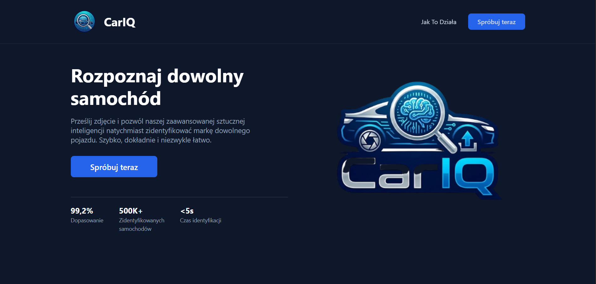
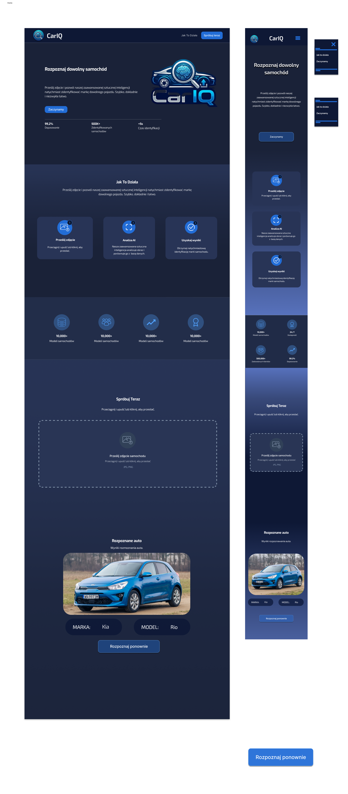

# 🚗 CarIQ - AI-Powered Vehicle Identifier

## 🌟 Overview
**CarIQ** is a modern full-stack web application developed as a collaborative project (team of 4). It enables instant identification of car makes and models from uploaded photos. By leveraging the **Google Gemini AI (Vision)** model, the system provides high-accuracy recognition and generates interesting automotive trivia for the user.

## 🎨 My Role: UI/UX Designer & Frontend Developer
I was responsible for the visual layer and user experience of the application:
* **UI/UX Design**: Created the conceptual low-fidelity prototype in **Figma**, establishing the layout, user flow, and dark-mode aesthetic.
* **Branding & Asset Design**: Designed a custom icon set and branding elements in **Canva** to ensure a cohesive and professional look.
* **Frontend Development (Co-developer)**: Collaborated on building the responsive layout using **HTML5** and **CSS3**. I primarily focused on the **Hero section** and the **Upload UI**.
* **Responsiveness**: Implemented `@media` queries and a flexible grid system to ensure full compatibility with mobile devices, including the mobile "hamburger" menu.

## 🛠️ Tech Stack
* **Backend:** Python (Flask)
* **AI Engine:** Google Gemini 2.5 Flash (Vision API)
* **Frontend:** HTML5, CSS3 (Flexbox/Grid), JavaScript (Vanilla)
* **Design Tools:** Figma (Prototyping), Canva (Iconography)
* **Image Processing:** PIL (Pillow)

## 📸 Project Showcase

### Desktop Experience
A sleek, modern dashboard featuring a clear "Call to Action" and data-driven stats.

### Design Process (Figma)
The initial conceptual draft used as the blueprint for the final CSS implementation.

### Mobile Optimization
A look at the responsive design on mobile screens, showcasing the adaptive layout.

## 🚀 Key Features
* **Instant Preview**: Live preview of the selected image before analysis.
* **Asynchronous Communication**: Uses the `fetch` API for seamless image processing without page reloads.
* **Interactive UI**: Custom hover effects and smooth transitions to enhance user engagement.
* **Dynamic Content**: Renders AI-generated technical data and facts directly in the result container.

## ⚙️ Installation & Setup
1. Clone the repository.
2. Install dependencies: `pip install -r requirements.txt`.
3. Add your **Gemini API Key** in `app.py`.
4. Run the application: `python app.py`.
5. Access the app at: `http://127.0.0.1:5000`.
